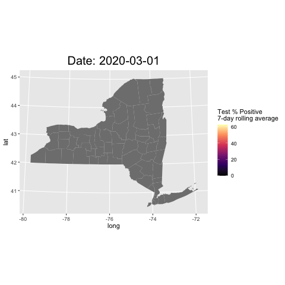
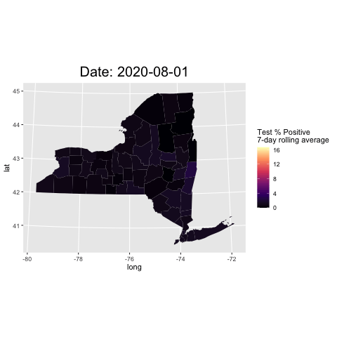
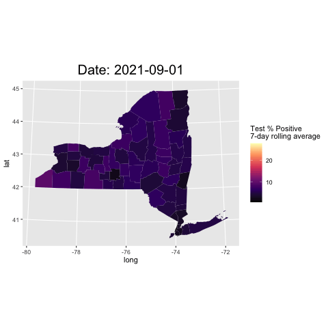

# Results

```{r setup, include=FALSE}
# this prevents package loading message from appearing in the rendered version of your problem set
knitr::opts_chunk$set(warning = FALSE, message = FALSE)
```

First, we want to determine the best measurement metrics for pandemic spread. From the dataset, we have three metrics to choose from: "New Positives", "Cumulative Number of Positives", "Test % Positive". During the pandemic, people and media often use number of new cases each day to reflect the severity of the pandemic, but we suspect daily new cases is not an accurate metrics, due to its potential correlation to the number of tests performed each day. With more tests performed, more new cases would be discovered and documented. At the start of the pandemic, the shortage of supplies and immature pandemic combat tactics were very likely to result in a low number of testing performed. Therefore, we hypothesize "Test % Positive" is a better metrics that reflect the pandemic spread, in contrary to what most people perceive. Moreoever, "New Positives" and "Total Number of Tests Performed" have a positive correlation.

See below for the cleaned dataset. There are no missing values, and we converted the "Test Date" column to date type, "Test % Positive" to double. We also converted all multi-word column titles to have an underscore "_" instead of a whitespace, to maintain best coding practices. On top of this, we also converted the percentage sign in "Test_%_Positive" to be the word "pct", so the column became "Test_pct_Positive".

```{r cleaning}
# install.packages("arrow")
# install.packages("tidyverse")
# install.packages("devtools")
# devtools::install_github("UrbanInstitute/urbnmapr")
# install.packages("ggplot2")
# install.packages("ggridges")
# install.packages("gganimate")
# install.packages("gifski")
# install.packages("transformr")
# install.packages("zoo")
# install.packages("dplyr")

library(arrow)
library(tidyverse)
library(urbnmapr)
library(ggplot2)
library(ggridges)
library(gganimate)
library(gifski)
library(transformr)
library(zoo)
library(dplyr)

df <- read_csv("data/NYC_testing_data.csv")
names(df)<-str_replace_all(names(df), c(" " = "_"))
colnames(df)[which(names(df) == "Test_%_Positive")] <- "Test_pct_Positive"
df$Test_Date<-as.Date(parsedate::parse_date(df$Test_Date))
df$Test_pct_Positive<-sapply(df$Test_pct_Positive, function(x) as.numeric(substr(x, 1, nchar(x)-1)))

df

```


The below scatter graph gives an overview the correlation between Number of Tests Performed and New Positives on a county level.From the graph, we can distinctly see that there is much more data for New York City and Statewide. This results in dots concentrating together for scatterplots for other counties.
```{r}
p1 <- ggplot(df, aes(New_Positives, Total_Number_of_Tests_Performed)) +  
  geom_point()+
  facet_wrap(~County)+  
  ggtitle("Correlation between Number of Tests Performed and New Positives by County") +
  xlab("New Positives")+
  ylab("Number of Tests Performed")

p1
```


Therefore, we decide to look at New York City and Statewide individually first, to see if there exsits a correlation between New Positives and Total number of tests.The graphs shows a strong positive relationship between the two. This provides evidence to our hypothesis that daily new cases is influenced by number of tests, therefore it is a biased metrics to measure the pandemic spread.
```{r}
df_filtered<-df%>% filter(df$County == "New York City")
p2 <- ggplot(df_filtered, aes(New_Positives, Total_Number_of_Tests_Performed)) +  
  geom_point()+
  ggtitle("Correlation between Number of Tests Performed and New Positives in NYC") +
  xlab("New Positives")+
  ylab("Number of Tests Performed")

df_filtered<-df%>% filter(df$County == "STATEWIDE")
p3 <- ggplot(df_filtered, aes(New_Positives, Total_Number_of_Tests_Performed)) +  
  geom_point()+
  ggtitle("Correlation between Tests Performed and New Positives in the NY State") +
  xlab("New Positives")+
  ylab("Number of Tests Performed")

p2
p3
```

To see if the above finding is true for other counties, we use a parallel coordinate plot. After we filtered out NYC and statewide, we noticed a few extreme outliers that negatively impacts the visibility of the majority of data. We decided to remove those outliers using the IQR method. We further sampled 100 rows of data for clearer visualization. In the resulting parallel corrdinate plot, we noticed the majority of lines are parallel to each other, shooting upwards. This adds more evidence that daily new cases is influenced by number of tests in other counties as well.

```{r}
library(GGally)
df_filtered<-df%>% filter(df$County != "New York City" & df$County != "STATEWIDE")
Q1 <- quantile(df_filtered$New_Positives, .25)
Q3 <- quantile(df_filtered$New_Positives, .75)
IQR <- IQR(df_filtered$New_Positives)
df_filtered <- subset(df_filtered, New_Positives > (Q1 - 1.5*IQR) & New_Positives < (Q3 + 1.5*IQR))
Q1 <- quantile(df_filtered$Total_Number_of_Tests_Performed, .25)
Q3 <- quantile(df_filtered$Total_Number_of_Tests_Performed, .75)
IQR <- IQR(df_filtered$Total_Number_of_Tests_Performed)
df_filtered <- subset(df_filtered, Total_Number_of_Tests_Performed > (Q1 - 1.5*IQR) & Total_Number_of_Tests_Performed < (Q3 + 1.5*IQR))

df_filtered_sample<-sample_n(df_filtered, 100)
p4 <- ggparcoord(df_filtered_sample, columns=c(3,5), 
          title = "Parallel coordinate plot for COVID cases in counties excluding NYC") +
  theme(plot.title = element_text(size=16, hjust = 0.5))
p4
```

In following two time series graph shows how New Positives and Number of Tests Performed changes overtime, with loess smoothing curves. We can clearly see that since the beginning of COVID-19, the number of tests performed gradually increases overtime and peaks at 2022. One explanation for this is there was a severe shortage of supplies and medical staffs at first. Interestingly, New Positives follows a similar trend: slowly increasing at first, and peaks at 2022. This again demonstrates the what New Cases are measuring may not truly be the daily new cases, but the cases identified through testing. 

```{r}
p5 <- ggplot(df %>% filter(df$County=="New York City"), 
       aes(x=Test_Date, y=New_Positives)) + 
  geom_line() + 
  geom_smooth(method = "loess", span = .5, se = FALSE)+
  theme_grey(14) +
  labs(
    title = "New York City New COVID Cases Each Day",
    x = "Date",
    y = "New Positives"
  ) +
  theme(plot.title = element_text(size=16, hjust = 0.5))
p5
```

```{r}
p6 <- ggplot(df %>% filter(df$County=="New York City"), 
       aes(x=Test_Date, y=Total_Number_of_Tests_Performed)) + 
  geom_line() +
  geom_smooth(method = "loess", span = .5, se = FALSE)+
  theme_grey(14) +
  labs(
    title = "New York City Total Tests Done Each Day",
    x = "Date",
    y = "New Positives"
  ) +
  theme(plot.title = element_text(size=16, hjust = 0.5))
p6
```


In conclusion, we decide to use "Test % Positive" as the pandemic spread measurement metrics for the remaining of this research. This metric eliminates the bias introduced by the number of tests and can more accurately reflect the pandemic spread. So, now that we have found our appropriate metric for measuring COVID spread, we might begin to attempt to answer our more explorative questions. That is, how does COVID spread geographically, how many waves has New York state experienced, and do these waves differ by location? To tackle these questions, we can examine time series plots of how the Test % Positive rate has changed over time. We can overlay multiple different counties together to examine results. To start, let's use NYC and the Bronx to get an initial answer.

```{r}
counties_to_plot = c("New York City", "Bronx")
sparse_df = df %>% filter(County %in% counties_to_plot)

p7 <- ggplot(sparse_df, aes(x=Test_Date, y=Test_pct_Positive, color=County)) +
  geom_line() +
  labs(
    title = "New York State Positive COVID Tests Over Time",
    x = "Date",
    y = "% Positive Tests"
  ) +
  theme(plot.title = element_text(size=16, hjust = 0.5))

p7
```
We'll also compute 3-day and 7-day rolling averages for the positive test rate (for stability purposes), and display them in a similar manner. These plots are shown below.

```{r}
# Add rolling average columns
df <- df %>%
    arrange(desc(County)) %>% 
    group_by(County) %>% 
    mutate(Test_pct_Positive_7da = rollmean(Test_pct_Positive, k = 7, fill = NA)) %>% 
    mutate(Test_pct_Positive_3da = rollmean(Test_pct_Positive, k = 3, fill = NA)) %>%
  ungroup()
```

```{r}


counties_to_plot = c("New York City", "Bronx")
sparse_df = df %>% filter(County %in% counties_to_plot)

p8 <- ggplot(sparse_df, aes(x=Test_Date, y=Test_pct_Positive_3da, color=County)) +
  geom_line() +
  labs(
    title = "New York State Positive COVID Tests Over Time",
    x = "Date",
    y = "% Positive Tests (3-day rolling average)"
  ) +
  theme(plot.title = element_text(size=16, hjust = 0.5))

p9 <- ggplot(sparse_df, aes(x=Test_Date, y=Test_pct_Positive_7da, color=County)) +
  geom_line() +
  labs(
    title = "NYC Positive COVID Tests Over Time",
    x = "Date",
    y = "% Positive Tests (7-day rolling average)"
  ) +
  theme(plot.title = element_text(size=16, hjust = 0.5))

p8
p9
```

NYC and the Bronx are geographically adjacent, and as such we might expect their COVID spread over time to be extremely similar - which is verified by our results. Based on the above plots, we may be willing to conclude that there are 3 waves, two of which being major. The first occurring at the beginning of 2020, the beginning of our COVID testing data collection period, a minor wave in late 2020 to early 2021, and another severe wave starting at the latter end of 2021. However, we haven't yet asked whether this is true across the entirety of New York State. We can create a similar plot, but including a comparison to two far-away counties: Erie (far West) and Franklin (far North).

```{r}
counties_to_plot = c("New York City", "Erie", "Franklin")
sparse_df = df %>% filter(County %in% counties_to_plot)

p10 <- ggplot(sparse_df, aes(x=Test_Date, y=Test_pct_Positive_7da, color=County)) +
  geom_line() +
  labs(
    title = "3 Different Counties' Positive COVID Tests Over Time",
    x = "Date",
    y = "% Positive Tests (7-day Rolling Average)"
  ) +
  theme(plot.title = element_text(size=16, hjust = 0.5))

p10
```

Perhaps somewhat surprisingly, we can see that while the positive test rate in Franklin mimics that of NYC somewhat closely, and yet there is a large discrepancy in Erie in early-mid 2022 - immediately after the 2nd major wave in NYC. So, it is clear that just using data from NYC may not be representative of the entire state. Instead, it allows us to form a reasonable first guess as to when the waves might have occurred, but more analysis is required to make any conclusions on a county-by-county basis. We'll aim to do this by creating heatmaps overlayed onto a map of New York state, on which we will be able to get a better sense of how COVID spreads geographically. To start with, we'll pick a somewhat arbitrary date at the beginning of 2022, and show our results.

```{r}
county_map_data <- tibble::as_tibble(counties)
county_map_data$county_name = sapply(county_map_data$county_name, function(x) sub(" County", "", x))
```

```{r}
sample_date = as.Date("2022-1-1")
sample_test_data = df %>% filter(Test_Date == sample_date, Geography=="COUNTY")

sample_data <- left_join(data1, counties_clean, by = c('County'='county_name')) 

p11 <- sample_data %>%
  ggplot(aes(long, lat, group = group, fill = Test_pct_Positive_7da)) +
  geom_polygon(color = NA) +
  coord_map(projection = "albers", lat0 = 39, lat1 = 45) +
  labs(fill = "Test % Positive\n7-day rolling average") +
  ggtitle(paste("Test % Positive by County on", sample_date, sep=" ")) +
  theme(plot.title = element_text(size=20, hjust = 0.5)) +
  scale_fill_viridis_c(option = "A")

p11

```

As can be seen, on any given day, it is very possible that positive test rate differs quite highly depending on where you are within NY state. In order to get a better sense of how these rates develop over time, we'll generate an animated plot over the time in which we have data.

```{r}
df_only_counties = df %>% filter(Geography=="COUNTY")
df_with_map_data <- left_join(df_only_counties, county_map_data, by = c('County'='county_name'))
```

```{r}
animated_plot1 <-
  ggplot(df_with_map_data, aes(long, lat, group = group, fill = Test_pct_Positive_7da)) +
  geom_polygon(color = NA) +
  coord_map(projection = "albers", lat0 = 39, lat1 = 45) +
  labs(fill = "Test % Positive\n7-day rolling average") +
  theme(plot.title = element_text(size=20, hjust = 0.5)) +
  labs(title = 'Date: {frame_time}') +
  scale_fill_viridis_c(option = "A") +
  transition_time(Test_Date) +
  ease_aes('linear')

# We want one frame per date of data, and will play our gif at a rate of 30fps
num_dates = length(unique(df$Test_Date))
ani1 <- animate(animated_plot1, nframes = num_dates, fps = 30, renderer = gifski_renderer())
# anim_save("gif_outputs/7-day rolling average (all dates).gif", ani1)
```

```{r}

```

We can see that despite small, isolated instances of COVID outbreaks at various points, our hypothesis of when the waves occur based on the NYC time series plot seems to be mostly accurate. That is, (of course, beyond the initial outbreak) one smaller wave beginning at the tail end of 2020 and a large wave at the end of 2021. To get a better sense of those two instances, we'll also created animated plots over those two time frames, shown below.

```{r}
min_date = as.Date("2020-08-01")
max_date = as.Date("2021-04-1")
filtered_data = df_with_map_data %>% filter(Test_Date >= min_date, Test_Date <= max_date)
animated_plot2 <-
  ggplot(filtered_data, aes(long, lat, group = group, fill = Test_pct_Positive_7da)) +
  geom_polygon(color = NA) +
  coord_map(projection = "albers", lat0 = 39, lat1 = 45) +
  labs(fill = "Test % Positive\n7-day rolling average") +
  theme(plot.title = element_text(size=20, hjust = 0.5)) +
  labs(title = 'Date: {frame_time}') +
  scale_fill_viridis_c(option = "A") +
  transition_time(Test_Date) +
  ease_aes('linear')

num_dates = length(unique(filtered_data$Test_Date))
ani2 <- animate(animated_plot2, nframes = num_dates, fps = 30, renderer = gifski_renderer())
# anim_save("gif_outputs/7-day rolling average (late 2020).gif", ani2)
```

```{r}

```


```{r}
min_date = as.Date("2021-09-01")
max_date = as.Date("2022-04-1")
filtered_data = df_with_map_data %>% filter(Test_Date >= min_date, Test_Date <= max_date)
animated_plot3 <-
  ggplot(filtered_data, aes(long, lat, group = group, fill = Test_pct_Positive_7da)) +
  geom_polygon(color = NA) +
  coord_map(projection = "albers", lat0 = 39, lat1 = 45) +
  labs(fill = "Test % Positive\n7-day rolling average") +
  theme(plot.title = element_text(size=20, hjust = 0.5)) +
  labs(title = 'Date: {frame_time}') +
  scale_fill_viridis_c(option = "A") +
  transition_time(Test_Date) +
  ease_aes('linear')

num_dates = length(unique(filtered_data$Test_Date))
ani3 <- animate(animated_plot3, nframes = num_dates, fps = 30, renderer = gifski_renderer())
# anim_save("gif_outputs/7-day rolling average (late 2021).gif", ani3)
```

```{r}

```

Another qualitative piece of information that we can see from these two animations is the geography-based nature of the spread of COVID cases. In both instances, we see surges originating in localised areas followed by a subsequent burst of cases in the surrounding areas which rapidly spread state-wide.

In conclusion